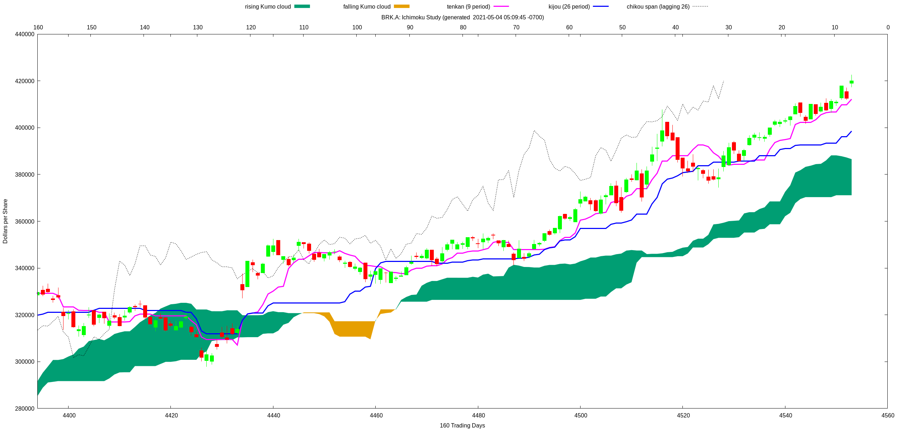

# An algorithm that finds the intersections in 2 discrete (long and short) moving averages. Incorporating Ruby on Rails / ActiveRecord model data for Statistical Analysis of Momentum.
------
Finds the golden cross and death crossings for a slow and fast moving average by comparing a 3-day sliding window (on a discrete set) for the intersection. In this example, the data is coming from Tenkan and Kijun data in an Ichimoku study on stock market data.
### matt.a.feenstra@gmail.com - copyright 2021
------

------
## Sample Output for Berkshire Hathway
```
matt@appserver:~/marketmath$ stub.rb brk.a

-- golden crosses --
[Thu, 08 May 2003,
 Fri, 13 Jun 2003,
 Fri, 08 Aug 2003,
 Fri, 02 Apr 2004,
 Wed, 09 Jun 2004,
 Fri, 02 Jul 2004,
 Mon, 30 Aug 2004,
 Tue, 16 Nov 2004,
 Thu, 20 Jan 2005,
 Tue, 31 May 2005,
 Thu, 09 Jun 2005,
 Wed, 06 Jul 2005,
 Wed, 05 Oct 2005,
 Thu, 04 May 2006,
 Mon, 31 Jul 2006,
 Tue, 13 Mar 2007,
 Mon, 04 Jun 2007,
 Fri, 03 Aug 2007,
 Wed, 07 May 2008,
 Tue, 12 Aug 2008,
 Fri, 05 Dec 2008,
 Fri, 20 Mar 2009,
 Wed, 16 Sep 2009,
 Fri, 23 Oct 2009,
 Tue, 03 Nov 2009,
 Fri, 08 Jan 2010,
 Tue, 15 Jun 2010,
 Tue, 03 Aug 2010,
 Thu, 11 Nov 2010,
 Thu, 13 Jan 2011,
 Thu, 31 Mar 2011,
 Thu, 30 Jun 2011,
 Thu, 08 Sep 2011,
 Wed, 07 Dec 2011,
 Tue, 03 Jan 2012,
 Fri, 04 May 2012,
 Thu, 14 Jun 2012,
 Thu, 29 Nov 2012,
 Mon, 08 Jul 2013,
 Thu, 19 Sep 2013,
 Tue, 22 Oct 2013,
 Thu, 21 Nov 2013,
 Wed, 19 Feb 2014,
 Wed, 28 May 2014,
 Wed, 02 Jul 2014,
 Tue, 28 Oct 2014,
 Tue, 30 Dec 2014,
 Fri, 13 Feb 2015,
 Fri, 01 May 2015,
 Thu, 15 Oct 2015,
 Mon, 30 Nov 2015,
 Tue, 16 Feb 2016,
 Mon, 11 Jul 2016,
 Fri, 28 Oct 2016,
 Mon, 07 Nov 2016,
 Mon, 06 Feb 2017,
 Tue, 02 May 2017,
 Fri, 02 Jun 2017,
 Mon, 26 Feb 2018,
 Tue, 17 Jul 2018,
 Thu, 08 Nov 2018,
 Thu, 17 Jan 2019,
 Thu, 21 Mar 2019,
 Wed, 10 Apr 2019,
 Fri, 14 Jun 2019,
 Tue, 10 Sep 2019,
 Mon, 21 Oct 2019,
 Wed, 12 Feb 2020,
 Mon, 13 Apr 2020,
 Tue, 02 Jun 2020,
 Fri, 17 Jul 2020,
 Wed, 06 Jan 2021,
 Mon, 05 Apr 2021,
 Fri, 09 Apr 2021]

-- death crosses --
[Tue, 10 Jun 2003,
 Tue, 08 Jul 2003,
 Tue, 16 Sep 2003,
 Tue, 16 Mar 2004,
 Mon, 26 Apr 2004,
 Wed, 23 Jun 2004,
 Wed, 28 Jul 2004,
 Thu, 13 Jan 2005,
 Wed, 02 Mar 2005,
 Tue, 07 Jun 2005,
 Mon, 13 Jun 2005,
 Wed, 27 Jul 2005,
 Fri, 30 Dec 2005,
 Wed, 01 Feb 2006,
 Tue, 13 Jun 2006,
 Fri, 16 Jun 2006,
 Fri, 05 Jan 2007,
 Thu, 15 Feb 2007,
 Thu, 24 May 2007,
 Wed, 20 Jun 2007,
 Mon, 30 Jul 2007,
 Tue, 25 Sep 2007,
 Mon, 03 Mar 2008,
 Tue, 17 Jun 2008,
 Tue, 07 Oct 2008,
 Wed, 31 Dec 2008,
 Fri, 24 Apr 2009,
 Wed, 03 Jun 2009,
 Tue, 25 Aug 2009,
 Wed, 07 Oct 2009,
 Thu, 29 Oct 2009,
 Wed, 02 Dec 2009,
 Thu, 14 Jan 2010,
 Thu, 25 Mar 2010,
 Thu, 22 Jul 2010,
 Fri, 08 Oct 2010,
 Thu, 18 Nov 2010,
 Mon, 14 Mar 2011,
 Mon, 04 Apr 2011,
 Mon, 25 Jul 2011,
 Wed, 14 Sep 2011,
 Wed, 16 Nov 2011,
 Tue, 20 Dec 2011,
 Fri, 13 Apr 2012,
 Thu, 24 May 2012,
 Fri, 21 Jun 2013,
 Wed, 14 Aug 2013,
 Mon, 07 Oct 2013,
 Thu, 14 Nov 2013,
 Tue, 14 Jan 2014,
 Fri, 11 Apr 2014,
 Fri, 23 May 2014,
 Thu, 12 Jun 2014,
 Wed, 30 Jul 2014,
 Thu, 02 Oct 2014,
 Mon, 26 Jan 2015,
 Mon, 02 Mar 2015,
 Mon, 01 Jun 2015,
 Mon, 17 Aug 2015,
 Mon, 16 Nov 2015,
 Wed, 02 Dec 2015,
 Thu, 12 May 2016,
 Thu, 03 Nov 2016,
 Wed, 11 Jan 2017,
 Thu, 23 Mar 2017,
 Wed, 10 May 2017,
 Tue, 07 Nov 2017,
 Fri, 23 Mar 2018,
 Fri, 25 May 2018,
 Fri, 07 Dec 2018,
 Wed, 27 Feb 2019,
 Mon, 01 Apr 2019,
 Tue, 23 Jul 2019,
 Wed, 02 Oct 2019,
 Fri, 21 Feb 2020,
 Fri, 01 May 2020,
 Tue, 23 Jun 2020,
 Mon, 28 Sep 2020,
 Wed, 16 Dec 2020,
 Thu, 25 Mar 2021,
 Wed, 07 Apr 2021]
matt@appserver:~/marketmath$
```
